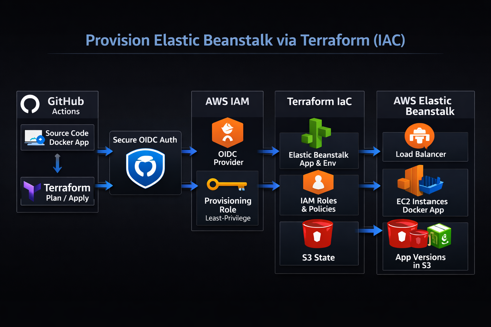

# AWS Beanstalk API Infrastructure

Infrastructure-as-Code project for deploying a containerized Web app or API on AWS Elastic Beanstalk using Terraform.

## Overview

This repository contains Terraform configurations to provision and manage an AWS Elastic Beanstalk application environment. It includes IAM policies for GitHub Actions OIDC integration and Terraform state management.

## Architecture Diagram

- The `infra-architecture.png` file contains a high-level diagram of the Elastic Beanstalk environment and related AWS resources. View it directly in this repository or open the file in your editor.
- 

## Project Structure

```
aws-beanstalk-api/
├── infra/                              # Terraform configuration files
│   ├── providers.tf                    # AWS provider and required versions
│   ├── variables.tf                    # Input variables (region, app name)
│   ├── locals.tf                       # Local values and computed variables
│   ├── iam.tf                          # IAM roles and policies for deployment
│   ├── elastic_beanstalk.tf            # Elastic Beanstalk environment configuration
│   └── beanstalk_application.tf        # Elastic Beanstalk application resource
├── policies/                           # IAM policy documents
│   ├── iam-github-oidc-provider.json   # GitHub Actions OIDC provider policy
│   ├── terraform-policy.json           # Terraform deployment permissions
│   └── terraform-aws-tfstate-policy.json # S3 state management permissions
├── .github/                            # CI/CD workflows
│   └── workflows/
│       └── main.yml                    # GitHub Actions Terraform workflow
├── infra-architecture.png              # Architecture diagram (PNG)
└── README.md                           # This file
```

## Prerequisites

- **Terraform**: >= 1.5.0
- **AWS Provider**: ~> 6.0
- **AWS Account**: Active AWS account with appropriate permissions
- **AWS CLI**: Configured with credentials or using IAM role

## Configuration

### Variables

The following variables can be configured in `infra/variables.tf`:

| Variable | Type | Default | Description |
|----------|------|---------|-------------|
| `region` | string | `eu-west-2` | AWS region for deployment |
| `app` | string | `demo` | Application name (lowercase characters only) |

### Environment Setup

1. **S3 Backend**: Configure Terraform state backend
   ```bash
   cd infra
   terraform init -backend-config="bucket=your-bucket" \
     -backend-config="key=terraform.tfstate" \
     -backend-config="region=eu-west-2" \
     -backend-config="encrypt=true"
   ```

2. **Provider Configuration**: The AWS provider is configured in `providers.tf` with the specified region

## Terraform Files

The `infra/` directory contains the main Terraform configuration files used to provision resources for this project:

- `infra/providers.tf` — provider configuration and required provider versions (AWS provider settings and provider constraints).
- `infra/variables.tf` — input variables and defaults used by the configuration (region, application name, backend keys, etc.).
- `infra/locals.tf` — computed local values and helper expressions used across the Terraform modules.
- `infra/iam.tf` — IAM roles, policies and trust relationships required for deployment (including roles used by GitHub Actions/OIDC and Beanstalk service roles).
- `infra/beanstalk_application.tf` — Elastic Beanstalk application resource definitions (application, app versions, and top-level config).
- `infra/elastic_beanstalk.tf` — Elastic Beanstalk environment and platform configuration (environment settings, platform, and environment-specific resources).

Review these files before making changes; update variables and backend settings in `infra/variables.tf` and your `.tfvars` files for environment-specific configuration.

## Usage

### Initial Deployment

```bash
cd infra

# Initialize Terraform (if not already done)
terraform init

# Plan the deployment
terraform plan

# Apply the configuration
terraform apply
```

### Destroy Resources

```bash
cd infra
terraform destroy
```

## IAM Policies

The `policies/` directory contains JSON IAM policy documents for:

- **GitHub Actions Integration**: OIDC provider setup for secure CI/CD without long-lived credentials
- **Terraform Deployment**: Permissions required for Terraform to manage Beanstalk resources
- **State Management**: S3 bucket policies for Terraform state file storage

These policies should be reviewed and customized based on your security requirements and least-privilege principles.

## Resources Created

- **AWS Elastic Beanstalk Application**: Named as `eb_{app_name}_app`
- **Description**: Configured for .NET Core API deployment

## State Management

Terraform state is stored in an S3 backend with encryption enabled. Ensure the backend bucket exists and has appropriate access controls before deploying.

## Best Practices

- Use `.tfvars` files for environment-specific variables (not committed to version control)
- Enable S3 versioning and server-side encryption for state files
- Review IAM policies regularly to maintain least-privilege access
- Use GitHub Actions with OIDC provider for CI/CD authentication
- Enable Terraform state locking with DynamoDB for team environments

## CI/CD (GitHub Actions)

- Workflow: `.github/workflows/main.yml` — automates Terraform `fmt`, `init`, `validate`, `plan` (on PRs) and `apply` (on pushes to `master`).
- Authentication: uses `aws-actions/configure-aws-credentials` with a role (OIDC) configured via repository secrets.
- Backend: `terraform init` reads S3 backend settings from repository secrets (`AWS_BUCKET_NAME`, `AWS_BUCKET_KEY_NAME`, etc.).

Refer to the workflow file for exact steps and environment variables.

## References

- [AWS Elastic Beanstalk Documentation](https://docs.aws.amazon.com/elasticbeanstalk/latest/dg/Welcome.html)
 - [Terraform Documentation](https://developer.hashicorp.com/terraform)

## Contributing

1. Validate Terraform configurations: `terraform validate`
2. Format code consistently: `terraform fmt`
3. Review plan output before applying changes
4. Test in development environment first

## License

[Add your license here]

## Support

For issues or questions, please contact the team or open an issue in the repository.
